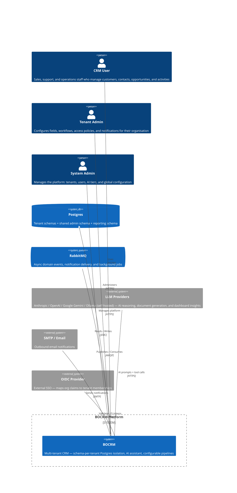
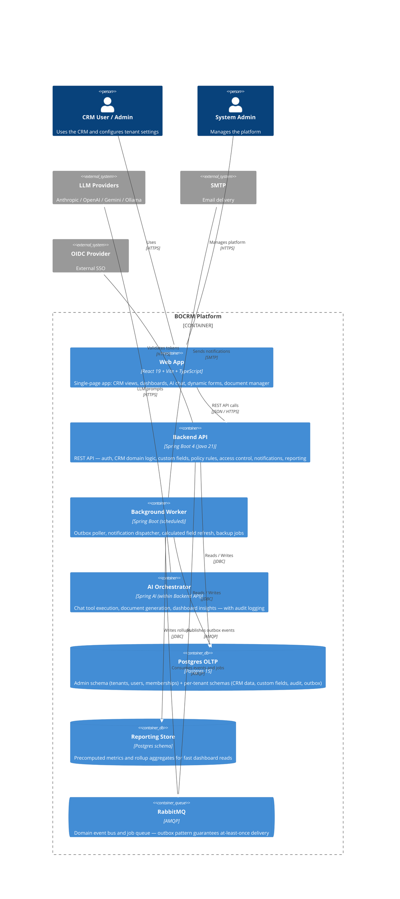
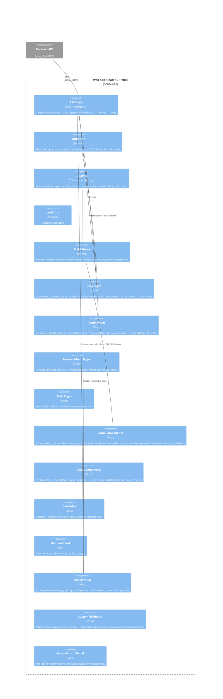
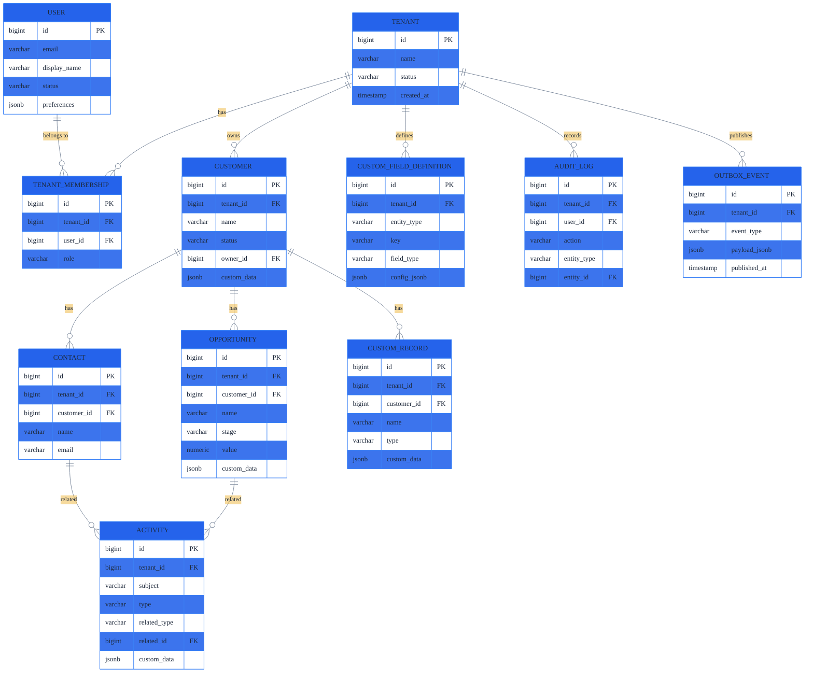

# Architecture

## Goals
- Boring and predictable: minimal surprise, easy to operate.
- Modular: clear domain boundaries and ownership.
- Cost-effective: run on one server early; scale later.
- Multi-tenant and secure by default.

## Non-goals (for now)
- Global multi-region active-active.
- Near-real-time OLAP at huge scale.

## Evolution Path
1. Single server, modular monolith, one Postgres instance
2. Add read replicas, background workers, and reporting db
3. Split into services per domain when load or team size demands

---

## C4 Level 1 — System Context

---

## C4 Level 2 — Container Diagram

---

## C4 Level 3 — Backend API Components

```mermaid
%%{init: {'theme': 'base', 'themeVariables': {'primaryColor': '#2563eb', 'primaryTextColor': '#fff', 'primaryBorderColor': '#1d4ed8', 'lineColor': '#64748b', 'secondaryColor': '#f1f5f9', 'tertiaryColor': '#e2e8f0', 'background': '#ffffff', 'fontFamily': 'ui-sans-serif, system-ui, sans-serif'}}}%%
C4Component
    title BOCRM — Backend API Components

    Container(web, "Web App", "React + Vite", "UI and chat")
    ContainerDb(oltp, "Postgres OLTP", "Postgres", "Admin + tenant schemas")
    ContainerQueue(mq, "RabbitMQ", "AMQP", "Events and jobs")
    System_Ext(llm, "LLM Providers", "Anthropic / OpenAI / Gemini / Ollama")

    Container_Boundary(api, "Backend API") {
        Component(auth, "Auth", "Spring Security + JJWT", "Login, refresh, tenant switching, OIDC external login, onboarding")
        Component(tenancy, "Tenancy", "Hibernate SCHEMA mode", "Schema routing per request via TenantContext ThreadLocal")
        Component(crm, "CRM Core", "Spring Data JPA", "Customers, Contacts, Opportunities, Activities — CRUD + advanced search")
        Component(customRecords, "CustomRecords", "Spring Data JPA", "CustomRecord management linked to opportunities and customers")
        Component(docs, "Documents", "Spring Data JPA", "File storage, upload, preview, and AI-generated document tracking")
        Component(customfields, "Custom Fields", "Spring Data JPA + CEL", "Tenant-configurable field definitions stored as JSONB on entities")
        Component(calcfields, "Calculated Fields", "CEL Evaluator", "Expression-based derived fields with background refresh queue")
        Component(policy, "Policy Rules", "OPA / Rego", "DENY / WARN business rules evaluated on every CRM mutation via OPA sidecar")
        Component(access, "Access Control", "Spring Data JPA", "Per-record OPEN / READ_ONLY / HIDDEN policies + user/group grants")
        Component(groups, "User Groups", "Spring Data JPA", "Named groups for bulk access grants")
        Component(notify, "Notifications", "Outbox + SMTP", "In-app inbox + email dispatch with per-user opt-in preferences")
        Component(reporting, "Reporting", "Spring Data JPA", "Dashboard summary, sales pipeline, activities by type, conversion rates")
        Component(chat, "AI Chat", "Spring AI", "Tool-calling chat with full CRM read/write access and audit logging")
        Component(insight, "Dashboard Insight", "Spring AI + news", "Clippy-style per-tenant insight with multi-provider LLM and smart news context")
        Component(templates, "Document Templates", "Spring Data JPA", "Saved style templates for slide decks, one-pagers, and CSV exports")
        Component(opptypes, "Opportunity Types", "Spring Data JPA", "Tenant-defined pipeline types with distinct custom field sets")
        Component(bulk, "Bulk Operations", "Spring Data JPA", "Batch update and delete across entity types")
        Component(backup, "Tenant Backup", "Schema dump", "On-demand backup and restore jobs per tenant")
        Component(audit, "Audit Log", "Spring Data JPA", "Immutable write log for all CRM and AI actions")
        Component(outbox, "Outbox Publisher", "Spring scheduled", "Polls outbox_events and publishes to RabbitMQ with retry")
        Component(admin, "Tenant Admin", "Spring Data JPA", "Logo, settings, user membership, AI tier, RBAC management")
        Component(sysadmin, "System Admin", "Spring Data JPA", "Platform-wide tenant, user, AI model, and tier management")
    }

    Rel(web, auth, "Auth requests", "HTTPS")
    Rel(web, crm, "CRM CRUD", "HTTPS")
    Rel(web, chat, "Chat messages", "HTTPS")
    Rel(auth, tenancy, "Resolves schema", "in-process")
    Rel(crm, customfields, "Validates JSONB fields", "in-process")
    Rel(crm, calcfields, "Queues refresh", "in-process")
    Rel(crm, policy, "Validates mutations", "in-process")
    Rel(crm, access, "Checks visibility", "in-process")
    Rel(crm, audit, "Writes audit events", "in-process")
    Rel(chat, llm, "LLM prompts", "HTTPS")
    Rel(insight, llm, "LLM prompts", "HTTPS")
    Rel(outbox, mq, "Publishes events", "AMQP")
    Rel(crm, oltp, "Reads / Writes", "JDBC")
```

---

## C4 Level 3 — Frontend Components

---

## Data Model — Simplified

---

## Data Model — Detailed

```mermaid
%%{init: {'theme': 'base', 'themeVariables': {'primaryColor': '#2563eb', 'primaryTextColor': '#1e293b', 'primaryBorderColor': '#3b82f6', 'lineColor': '#64748b', 'background': '#ffffff', 'fontFamily': 'ui-sans-serif, system-ui, sans-serif'}}}%%
erDiagram
    TENANT {
        bigint id PK
        varchar name UK
        varchar external_org_id UK
        varchar status
        timestamp created_at
        timestamp updated_at
    }
    USER {
        bigint id PK
        varchar email UK
        varchar display_name
        varchar password_hash
        varchar oauth_provider
        varchar oauth_id
        varchar status
        jsonb preferences
        timestamp created_at
    }
    TENANT_MEMBERSHIP {
        bigint id PK
        bigint tenant_id FK
        bigint user_id FK
        varchar role
        timestamp joined_at
    }
    TENANT_SETTINGS {
        bigint id PK
        bigint tenant_id FK
        jsonb settings
    }
    TENANT_SUBSCRIPTION {
        bigint id PK
        bigint tenant_id FK
        bigint tier_id FK
        bigint tokens_used_this_period
        timestamp period_start_date
        timestamp period_end_date
    }
    ASSISTANT_TIER {
        bigint id PK
        varchar name UK
        varchar display_name
        bigint monthly_token_limit
        varchar model_id
        varchar provider
        numeric price_monthly
        boolean enabled
    }
    ENABLED_AI_MODEL {
        bigint id PK
        varchar provider
        varchar model_id
        boolean enabled
    }
    CUSTOMER {
        bigint id PK
        bigint tenant_id FK
        varchar name
        varchar status
        bigint owner_id FK
        varchar industry
        varchar website
        text notes
        jsonb custom_data
        jsonb table_data_jsonb
        timestamp created_at
        timestamp updated_at
    }
    CONTACT {
        bigint id PK
        bigint tenant_id FK
        bigint customer_id FK
        varchar name
        varchar email
        varchar phone
        varchar title
        boolean primary
        varchar status
        jsonb custom_data
        timestamp created_at
    }
    OPPORTUNITY {
        bigint id PK
        bigint tenant_id FK
        bigint customer_id FK
        varchar name
        varchar stage
        varchar status
        numeric value
        numeric probability
        date close_date
        bigint owner_id FK
        varchar opportunity_type_slug
        jsonb custom_data
        timestamp created_at
    }
    OPPORTUNITY_TYPE {
        bigint id PK
        bigint tenant_id FK
        varchar name
        varchar slug UK
        varchar description
        int display_order
    }
    OPPORTUNITY_CONTACT {
        bigint opportunity_id FK
        bigint contact_id FK
    }
    ACTIVITY {
        bigint id PK
        bigint tenant_id FK
        varchar subject
        varchar type
        text description
        timestamp due_at
        bigint owner_id FK
        varchar related_type
        bigint related_id
        varchar status
        jsonb custom_data
        timestamp created_at
    }
    CUSTOM_RECORD {
        bigint id PK
        bigint tenant_id FK
        varchar name
        varchar type
        varchar serial_number
        varchar status
        bigint owner_id FK
        bigint customer_id FK
        text notes
        jsonb custom_data
        timestamp created_at
    }
    CUSTOM_RECORD_OPPORTUNITY {
        bigint custom_record_id FK
        bigint opportunity_id FK
    }
    CUSTOM_FIELD_DEFINITION {
        bigint id PK
        bigint tenant_id FK
        varchar entity_type
        varchar key
        varchar label
        varchar field_type
        jsonb config_jsonb
        int display_order
    }
    CALCULATED_FIELD_DEFINITION {
        bigint id PK
        bigint tenant_id FK
        varchar entity_type
        varchar key
        varchar label
        text expression
        int display_order
    }
    CALCULATED_FIELD_VALUE {
        bigint id PK
        bigint tenant_id FK
        varchar entity_type
        bigint entity_id
        bigint calculated_field_id FK
        jsonb value
        timestamp created_at
    }
    POLICY_RULE {
        bigint id PK
        bigint tenant_id FK
        varchar entity_type
        varchar name
        text expression
        varchar action
        int display_order
    }
    RECORD_ACCESS_POLICY {
        bigint id PK
        bigint tenant_id FK
        varchar entity_type
        bigint entity_id
        bigint owner_id FK
        varchar access_mode
    }
    RECORD_ACCESS_GRANT {
        bigint id PK
        bigint tenant_id FK
        varchar entity_type
        bigint entity_id
        varchar grantee_type
        bigint grantee_id
        varchar permission
    }
    USER_GROUP {
        bigint id PK
        bigint tenant_id FK
        varchar name
        varchar description
    }
    USER_GROUP_MEMBERSHIP {
        bigint id PK
        bigint group_id FK
        bigint user_id FK
    }
    DOCUMENT_TEMPLATE {
        bigint id PK
        bigint tenant_id FK
        varchar name
        varchar template_type
        jsonb style_json
        boolean is_default
    }
    TENANT_DOCUMENT {
        bigint id PK
        bigint tenant_id FK
        varchar name
        varchar mime_type
        varchar source
        varchar content_type
        varchar linked_entity_type
        bigint linked_entity_id
        timestamp created_at
    }
    NOTIFICATION_INBOX {
        bigint id PK
        bigint tenant_id FK
        bigint user_id FK
        varchar message_type
        varchar subject
        text body
        boolean is_read
        timestamp created_at
    }
    NOTIFICATION_TEMPLATE {
        bigint id PK
        bigint tenant_id FK
        varchar name
        varchar notification_type
        varchar subject
        text body
    }
    CHAT_MESSAGE {
        bigint id PK
        bigint tenant_id FK
        bigint user_id FK
        varchar role
        text content
        varchar context_entity_type
        bigint context_entity_id
        timestamp created_at
    }
    SAVED_FILTER {
        bigint id PK
        bigint tenant_id FK
        bigint user_id FK
        varchar name
        varchar entity_type
        jsonb filter_config_jsonb
    }
    AUDIT_LOG {
        bigint id PK
        bigint tenant_id FK
        bigint user_id FK
        varchar action
        varchar entity_type
        bigint entity_id
        jsonb old_value
        jsonb new_value
        timestamp created_at
    }
    OUTBOX_EVENT {
        bigint id PK
        bigint tenant_id FK
        varchar event_type
        jsonb payload_jsonb
        int retry_count
        timestamp published_at
        timestamp created_at
    }
    TENANT_BACKUP_JOB {
        bigint id PK
        bigint tenant_id FK
        varchar job_type
        varchar status
        boolean includes_data
        varchar label
        timestamp created_at
    }
    TOKEN_USAGE_LEDGER {
        bigint id PK
        bigint tenant_id FK
        bigint tokens_used
        varchar usage_type
        timestamp created_at
    }

    TENANT ||--o{ TENANT_MEMBERSHIP : ""
    USER ||--o{ TENANT_MEMBERSHIP : ""
    TENANT ||--o{ TENANT_SETTINGS : ""
    TENANT ||--o{ TENANT_SUBSCRIPTION : ""
    ASSISTANT_TIER ||--o{ TENANT_SUBSCRIPTION : ""
    TENANT ||--o{ CUSTOMER : ""
    CUSTOMER ||--o{ CONTACT : ""
    CUSTOMER ||--o{ OPPORTUNITY : ""
    CUSTOMER ||--o{ CUSTOM_RECORD : ""
    OPPORTUNITY ||--o{ OPPORTUNITY_CONTACT : ""
    CONTACT ||--o{ OPPORTUNITY_CONTACT : ""
    CUSTOM_RECORD ||--o{ CUSTOM_RECORD_OPPORTUNITY : ""
    OPPORTUNITY ||--o{ CUSTOM_RECORD_OPPORTUNITY : ""
    OPPORTUNITY_TYPE ||--o{ OPPORTUNITY : ""
    TENANT ||--o{ CUSTOM_FIELD_DEFINITION : ""
    TENANT ||--o{ CALCULATED_FIELD_DEFINITION : ""
    CALCULATED_FIELD_DEFINITION ||--o{ CALCULATED_FIELD_VALUE : ""
    TENANT ||--o{ POLICY_RULE : ""
    TENANT ||--o{ RECORD_ACCESS_POLICY : ""
    TENANT ||--o{ RECORD_ACCESS_GRANT : ""
    TENANT ||--o{ USER_GROUP : ""
    USER_GROUP ||--o{ USER_GROUP_MEMBERSHIP : ""
    USER ||--o{ USER_GROUP_MEMBERSHIP : ""
    TENANT ||--o{ DOCUMENT_TEMPLATE : ""
    TENANT ||--o{ TENANT_DOCUMENT : ""
    TENANT ||--o{ NOTIFICATION_INBOX : ""
    TENANT ||--o{ NOTIFICATION_TEMPLATE : ""
    TENANT ||--o{ CHAT_MESSAGE : ""
    TENANT ||--o{ SAVED_FILTER : ""
    TENANT ||--o{ AUDIT_LOG : ""
    TENANT ||--o{ OUTBOX_EVENT : ""
    TENANT ||--o{ TENANT_BACKUP_JOB : ""
    TENANT ||--o{ TOKEN_USAGE_LEDGER : ""
```

---

## Backend Modules

| Module | Responsibility |
|--------|----------------|
| **Auth** | JWT issuing and validation, tenant switching, OIDC external login, RBAC |
| **Tenancy** | Schema routing via TenantContext ThreadLocal, tenant provisioning, Flyway per-tenant migrations |
| **CRM Core** | Customers, Contacts, Opportunities, Activities — CRUD, advanced search, JSONB custom fields |
| **CustomRecords** | Custom Record management, linking to opportunities and customers |
| **Documents** | File storage, upload, preview, AI-generated document tracking, duplication |
| **Custom Fields** | Tenant-configurable field definitions (14+ types) stored as JSONB on entities |
| **Calculated Fields** | CEL expression evaluation, value caching, background refresh queue |
| **Policy Rules** | Rego (OPA sidecar) DENY/WARN guards evaluated on every CRM mutation, pre-validated at save time |
| **Access Control** | Per-record OPEN/READ_ONLY/HIDDEN policies, user/group explicit grants |
| **Notifications** | Outbox-based email + in-app inbox, per-user opt-in preferences, notification templates |
| **Reporting** | Dashboard summary, sales pipeline analytics, activity rollups |
| **AI Chat** | Tool-calling assistant with full CRM read/write access and audit logging |
| **AI Insight** | Per-tenant dashboard Clippy with multi-provider LLM fallback and smart news context |
| **Document Templates** | Saved style configurations for AI-generated slide decks, one-pagers, and CSV exports |
| **Opportunity Types** | Tenant-defined pipeline types with distinct field sets and slug-based routing |
| **Bulk Operations** | Batch update and delete across entity types |
| **Tenant Backup** | On-demand backup and restore jobs with downloadable payloads |
| **Audit** | Immutable write log for all CRM and AI actions |
| **Outbox** | Outbox pattern poller publishing domain events to RabbitMQ with retry |
| **System Admin** | Platform-wide tenant, user, AI model, and tier management |

---

## Security

| Concern | Approach |
|---------|----------|
| Authentication | JWT access tokens (short TTL) + refresh tokens with rotation |
| Multi-tenancy | Schema-per-tenant — no row-level filter; wrong schema = no rows |
| RBAC | Role encoded in JWT (`admin`, `member`, `manager`) per tenant membership |
| Record-level access | `RecordAccessPolicy` + `RecordAccessGrant` checked in every service method |
| AI actions | All tool calls logged to `audit_log`; confirm mode requires explicit user approval |
| Secrets scanning | gitleaks pre-commit hook + GitHub Actions CI scan |

---

## Observability

- **Structured logs** — JSON via Logback, correlated with tenant context
- **Metrics** — Micrometer (JVM, HTTP, custom business counters)
- **Tracing** — OpenTelemetry (instrumented at the Spring filter level)

---

## Deployment

- **Local dev** — Docker Compose (Postgres 5432, RabbitMQ 5672 + management UI 15672)
- **Early production** — single VM or small cluster; frontend served by same Spring Boot instance
- **CI/CD** — GitHub Actions builds JAR + frontend bundle → `bocrm-<version>.tar.gz` artifact
- **Auto-deploy** — pull-based poller on host checks GitHub releases every 15 min; see [docs/deployment.md](deployment.md)
- **Scale path** — add read replicas and separate worker process; split to services when team or load demands
